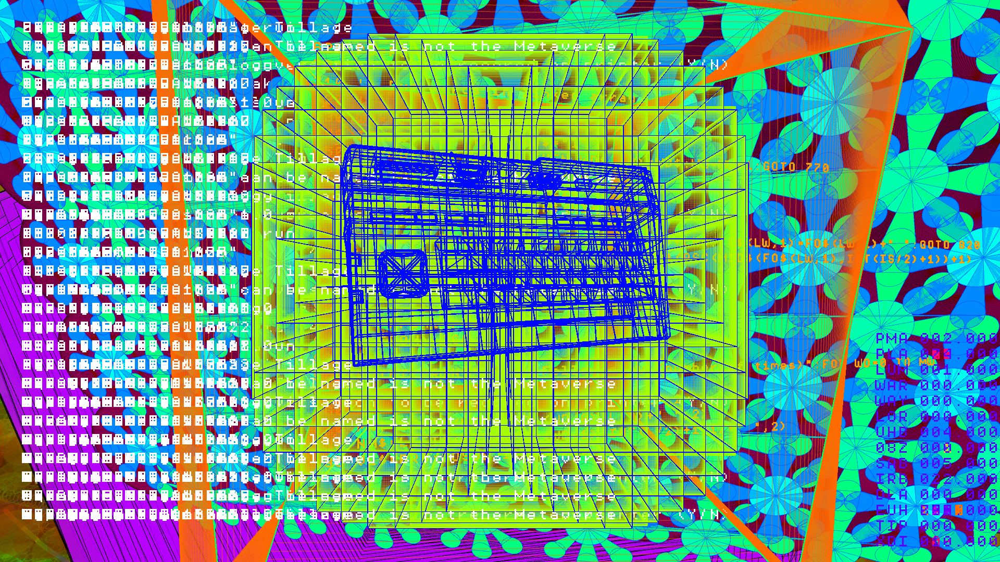
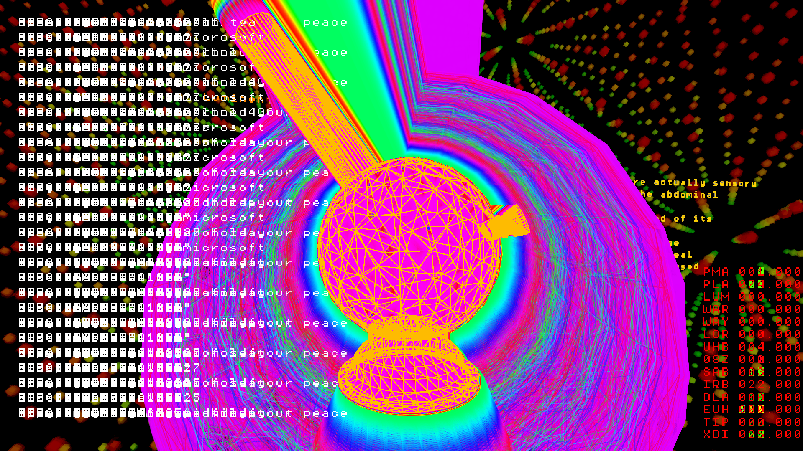
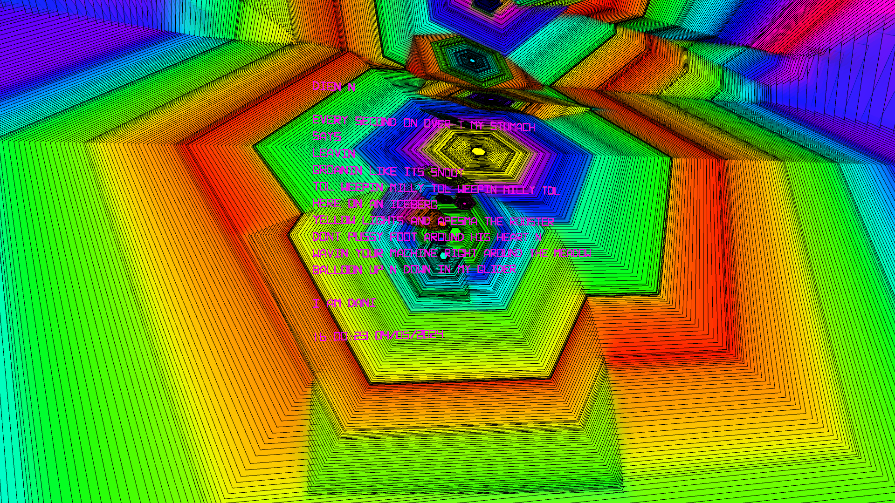

# i.am.dani

- [i.am.dani @ MSXGOTO40](https://bryanduggan.org/2024/04/01/vjing-with-i-am-dani-for-tadahiro-nitta-msxgoto40/) 
- i.am.dani @ [Audio Garden 2023](https://bryanduggan.org/2023/09/07/i-am-dani/)
- i.am.dani will be at [Audio Garden 2024](https://www.eventbrite.ie/e/audio-garden-festival-2024-tickets-699045352467)

i.am.dani celebrates the 40th birthday of MSX. Inspired by DANI, a chatbot from 1986, i.am.dani is about the experience of learning programming, and features work by myself and teams of students from TU Dublin Computer Science and Game Design. Developed in Java, using the Processing libraries for creative coding, i.am.dani features MIDI controlled, sound responsive visuals for music and algorithmic poetry made from the words of Captain Beefheart.

## Contributors:

- Bryan Duggan
- Jia Zhang
- Manar Saighi
- Laura Wei
- Cathal Small
- Fionn Seville
- Lilja O'Byrne
- Adrian Thomas Capacite
- Sarah Barron
- Jennifer Kearns
- Altahier Saleh
- Tommy Burke
