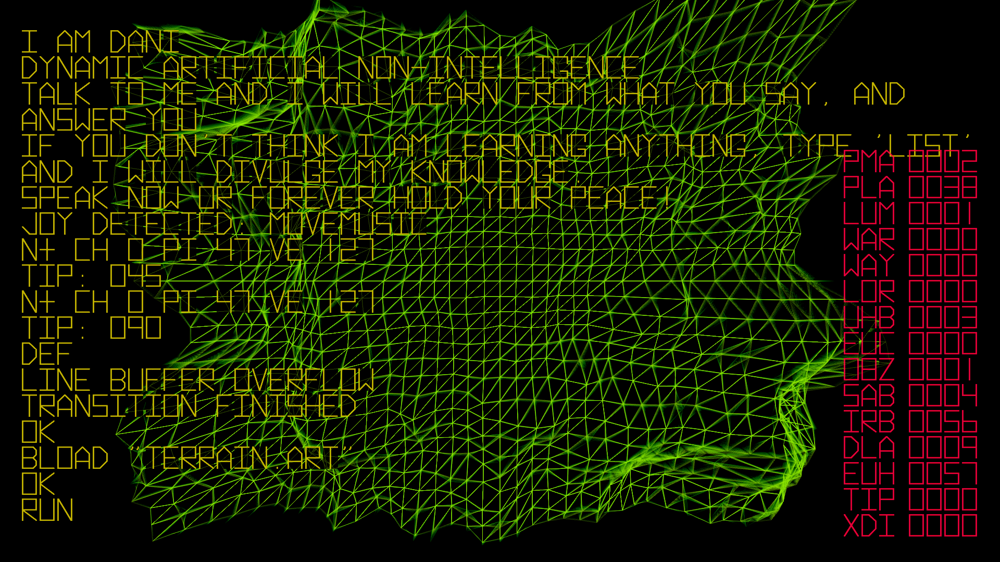
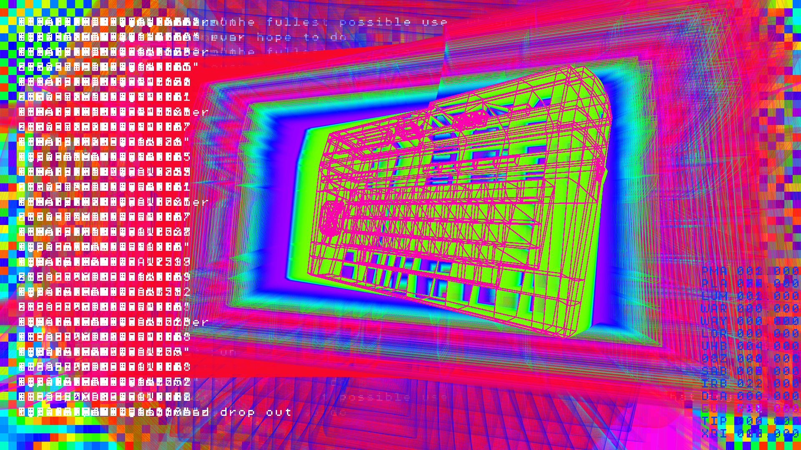
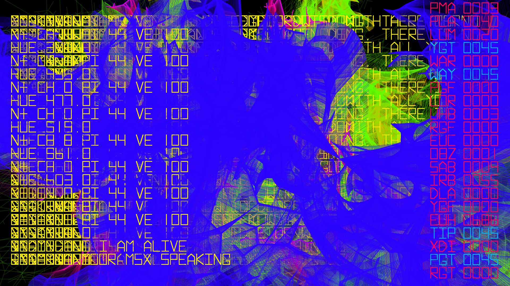
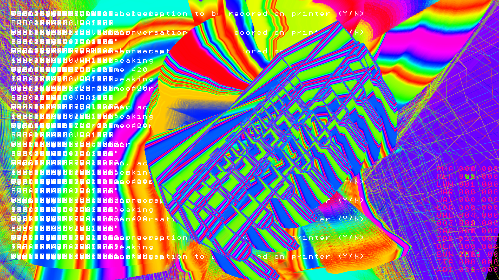

# i.am.dani

- [i.am.dani @ MSXGOTO40](https://bryanduggan.org/2024/04/01/vjing-with-i-am-dani-for-tadahiro-nitta-msxgoto40/) 
- i.am.dani @ [Audio Garden 2023](https://bryanduggan.org/2023/09/07/i-am-dani/)
- i.am.dani will be at [Audio Garden 2024](https://www.eventbrite.ie/e/audio-garden-festival-2024-tickets-699045352467)

i.am.dani celebrates the 40th birthday of MSX. Inspired by DANI, a chatbot from 1986, i.am.dani and features work by myself and teams of students from TU Dublin Computer Science and Game Design. Developed in Java, using the Processing libraries for creative coding, i.am.dani features MIDI controlled, sound responsive visuals for music and algorithmic poetry made from the words of Captain Beefheart.

## Keys
   
| MIDI Note | Keypress | Action |
|-----------|----------|--------|
| 36 | y | Shift hue counter-clockwise |
| 37 | i | Shift CCo (possibly color complement) counter-clockwise |
| 38 | j | Decrease yaw by QUARTER_PI |
| 39 | k | Decrease pitch by QUARTER_PI |
| 40 | l | Decrease roll by QUARTER_PI |
| 41 | m | Decrease cue value |
| 42 | r | Increase bass (SAB) by 2.0 |
| 43 | p | Take screenshot |
| 44 | t | Shift hue clockwise |
| 45 | u | Shift CCo (possibly color complement) clockwise |
| 46 | n | Increase yaw by QUARTER_PI |
| 47 | b | Increase pitch by QUARTER_PI |
| 48 | v | Increase roll by QUARTER_PI |
| 49 | x | Increase cue value |
| 51 | g | Toggle console visibility |
| 52 | h | Change to cued visual |
| 53 | SPACE | Reset to defaults |
| 54 | q | Set targetAld to 5 |
| 55 | w | Set targetAld to 0 |
| 56 | e | Decrease bass (SAB) by 2.0 |
| 57 | UP/LEFT arrow | Switch to previous visual |
| 58 | DOWN/RIGHT arrow | Switch to next visual |
| 59 | o | Switch to random visual |
| 60 | f | Randomize yaw, pitch, and roll |
| 61 | [ | Cycle through easing types |
| 62 | ] | Set duration to 0.0 |
| 63 | \ | Cycle through control types |
| - | ENTER | MIDI Connect |
| - | s | Toggle TRON/TROFF (exp variable) |
| - | c | Toggle CTRON/CTROFF (exp variable) |
| - | a | Set mode to Auto |
| - | d | Set mode to AutoRandom |
| - | z | Re-enter current art |
| - | SHIFT + 000-999 | Change to visual number 000-999 |
| - | 1 | Increase spe by 1 |
| - | 2 | Decrease spe by 1 |
| - | 3 | Increase targetSat by 5 (1-255) |
| - | 4 | Decrease targetSat by 5 (1-255) |
| - | 5 | Increase targetAld by 1 (0-50) |
| - | 6 | Decrease targetAld by 1 (0-50) |
| - | 7 | Increase bri by 1 (min 2, no upper bound) |
| - | 8 | Decrease bri by 1 (min 2) |
| - | 9 | Increase bhu (cycle through fonts) |
| - | 0 | Decrease bhu (cycle through fonts) |

## Contributors:

- Bryan Duggan
- Kate Johnston
- Rhys MacGregor-Mason
- Thomas Grumley
- Alan Turing
- Jia Zhang
- Manar Saighi
- Laura Wei
- Cathal Small
- Fionn Seville
- Lilja O'Byrne
- Adrian Thomas Capacite
- Sarah Barron
- Jennifer Kearns
- Altahier Saleh
- Tommy Burke
