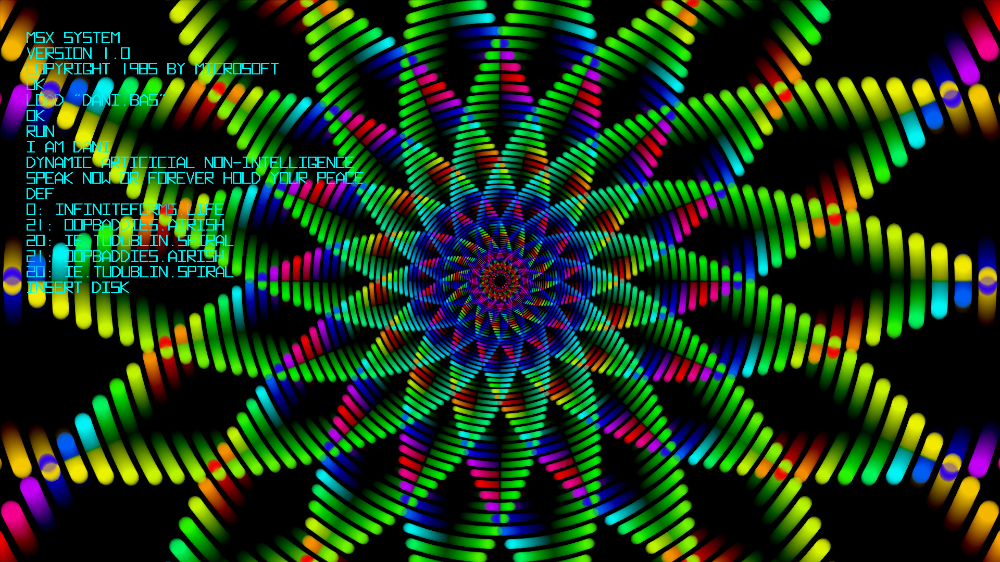
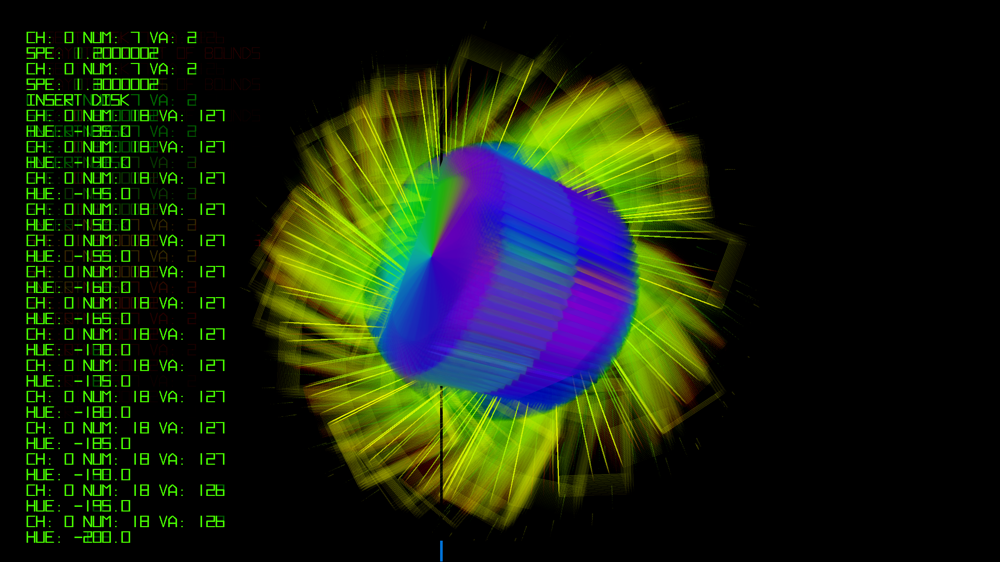

# i.am.dani

- [i.am.dani @ MSXGOTO40](https://bryanduggan.org/2024/04/01/vjing-with-i-am-dani-for-tadahiro-nitta-msxgoto40/) 
- i.am.dani @ Audio Garden 2023
- i.am.dani will be at Audio Garden 2024

i.am.dani celebrates the 40th Anniversary of the creation of the MSX Computer System in 1983. Inspired by DANI chatbot from 1986, i.am.dani is about the joy of learning programming, and features work by myself and teams of students from TU Dublin. Developed in Java using the Processing libraries for creative coding, i.am.dani features MIDI controlled, sound responsive visual pieces that can be used for visuals for DJ's and live music. Processing can trace it's inspirations from graphical programming languages used to learn programming such as MSX Basic as it contains commands for drawing shapes, manipulating colors and making sounds. 

## Contributors:

- Bryan Duggan
- Jia Zhang
- Manar Saighi
- Laura Wei
- Cathal Small
- Fionn Seville
- Lilja O'Byrne
- Adrian Thomas Capacite
- Sarah Barron
- Jennifer Kearns
- Altahier Saleh
